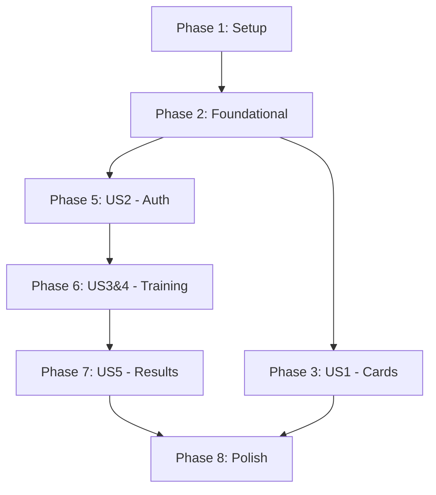

# Implementation Tasks: Phase 0 - 競技かるた訓練プラットフォーム

**Feature**: Phase 0 Karuta Training Platform
**Branch**: `002-phase0-karuta-training`
**Date**: 2026-01-17
**Spec**: [spec.md](./spec.md) | **Plan**: [plan.md](./plan.md)

## Overview

段階0の実装タスクを6つのフェーズに分割：

- **Phase 1**: Setup（プロジェクト初期化）
- **Phase 2**: Foundational（データ基盤）
- **Phase 3**: User Story 1（札一覧閲覧・めくり機能）- P1 MVP
- **Phase 4**: User Story 6（Seedデータ投入）- P3
- **Phase 5**: User Story 2（認証）- P2
- **Phase 6**: User Story 3 & 4（訓練＋保存）- P1 MVP核心
- **Phase 7**: User Story 5（成績閲覧）- P2
- **Phase 8**: Polish（セキュリティ・デプロイ）

**Total Tasks**: 91 tasks
**MVP Scope**: Phase 1-4, 6 (US1, US3, US4, US6) = 59 tasks

---

## Phase 1: Setup（プロジェクト初期化）

**Goal**: Vite + React + TypeScript + Tailwind CSS環境構築、Firebase接続、初回デプロイ

**Independent Test**: `npm run dev`でローカル起動 → http://localhost:5173 表示 → `npm run build`成功 → Firebase Hostingデプロイ成功

### Tasks

- [ ] T001 Initialize Vite + React + TypeScript project at apps/web/ using `npm create vite@latest`
- [ ] T002 [P] Install Tailwind CSS dependencies in apps/web/package.json (`tailwindcss`, `postcss`, `autoprefixer`)
- [ ] T003 [P] Create Tailwind config file at apps/web/tailwind.config.ts with content paths
- [ ] T004 [P] Create PostCSS config file at apps/web/postcss.config.js
- [ ] T005 [P] Import Tailwind directives in apps/web/src/index.css
- [ ] T006 [P] Install Firebase SDK in apps/web/package.json (`firebase@10.x`)
- [ ] T007 [P] Create environment variable template at apps/web/.env.example with VITE_ prefix
- [ ] T008 Create Firebase initialization file at apps/web/src/services/firebase.ts
- [ ] T009 [P] Create TypeScript types for Poem at apps/web/src/types/poem.ts
- [ ] T010 [P] Create TypeScript types for User at apps/web/src/types/user.ts
- [ ] T011 [P] Create TypeScript types for TrainingSet at apps/web/src/types/trainingSet.ts
- [ ] T012 Initialize Firebase project using `firebase init hosting` at repo root
- [ ] T013 Configure firebase.json for hosting with public: apps/web/dist
- [ ] T014 Create basic App component at apps/web/src/App.tsx with React Router setup
- [ ] T015 Build project using `npm run build` at apps/web/
- [ ] T016 Deploy to Firebase Hosting using `firebase deploy --only hosting`

**Deliverables**:
- ✅ SPA起動可能（`npm run dev`）
- ✅ Firebaseプロジェクト接続済み
- ✅ Hosting初回デプロイ成功

---

## Phase 2: Foundational（データ基盤）

**Goal**: Poems seed dataの準備、バリデーション、Firestore投入

**Independent Test**: `npm run seed:poems`実行 → コンソールに"✅ Seeded 100 poems successfully." → Firestore Consoleで/poemsコレクション100件確認

### Tasks

- [ ] T017 Create poems seed data schema at data/poems.seed.json with yomi/tori fields
- [ ] T018 Populate data/poems.seed.json with 100 poems (poemId: p001-p100, order: 1-100)
- [ ] T019 [P] Create seed validation script at scripts/validate-poems.ts for duplicate/required field checks
- [ ] T020 [P] Add poemId format validation (regex: ^p\d{3}$) in scripts/validate-poems.ts
- [ ] T021 [P] Add order range validation (1-100) in scripts/validate-poems.ts
- [ ] T022 [P] Add kimarijiCount range validation (1-6) in scripts/validate-poems.ts
- [ ] T023 Create Firestore seed script at scripts/seed-poems.ts using Admin SDK
- [ ] T024 Implement batch upsert logic in scripts/seed-poems.ts (merge: true for idempotency)
- [ ] T025 Add seed:poems npm script to package.json at repo root
- [ ] T026 Run validation script to verify poems.seed.json integrity
- [ ] T027 Execute seed script and verify 100 documents in Firestore /poems collection

**Deliverables**:
- ✅ `/poems`コレクションに100件投入完了
- ✅ バリデーション済みデータ

---

## Phase 3: User Story 1 - 札一覧閲覧とめくり機能（ログイン不要）

**Goal**: ログインなしで札を閲覧、yomi⇔tori切替、かな表示トグル、8/16枚表示切替、決まり字フィルタ

**Priority**: P1 MVP 🎯

**Independent Test**: ブラウザでHomeにアクセス → 「札を見る」クリック → 札一覧表示 → 札をクリックしてyomi⇔tori切り替え → ひらがな表示切替が動作 → 8枚/16枚表示切替が動作 → kimarijiCountフィルタで絞り込み

### Tasks

- [ ] T028 [P] [US1] Create poems service at apps/web/src/services/poems.service.ts with getAllPoems function
- [ ] T029 [P] [US1] Implement Firestore query in poems.service.ts (orderBy 'order')
- [ ] T030 [P] [US1] Create usePoems custom hook at apps/web/src/hooks/usePoems.ts
- [ ] T031 [P] [US1] Create Home page component at apps/web/src/pages/Home.tsx
- [ ] T032 [P] [US1] Add navigation link to /cards in Home.tsx
- [ ] T033 [US1] Create CardsList page component at apps/web/src/pages/Cards/CardsList.tsx
- [ ] T034 [P] [US1] Create PoemCard component at apps/web/src/components/PoemCard/PoemCard.tsx with flip functionality
- [ ] T035 [P] [US1] Implement yomi⇔tori toggle state in PoemCard.tsx (useState)
- [ ] T036 [P] [US1] Add kimariji and kimarijiCount display to PoemCard.tsx
- [ ] T037 [P] [US1] Create PoemCard styles at apps/web/src/components/PoemCard/PoemCard.module.css (optional)
- [ ] T038 [US1] Implement 8/16 display count toggle in CardsList.tsx (useState, slice)
- [ ] T039 [US1] Implement hiragana display toggle in CardsList.tsx (yomi/tori ⇔ yomiKana/toriKana)
- [ ] T040 [P] [US1] Create CardsFilter component at apps/web/src/pages/Cards/CardsFilter.tsx
- [ ] T041 [US1] Implement kimarijiCount filter UI in CardsFilter.tsx (1-6 buttons or dropdown)
- [ ] T042 [US1] Implement kimariji text search in CardsFilter.tsx (input field, filter logic)
- [ ] T043 [US1] Connect filter state to CardsList.tsx (filter poems array)
- [ ] T044 [US1] Add /cards route to App.tsx with CardsList component
- [ ] T045 [US1] Test card flip functionality in browser
- [ ] T046 [US1] Test 8/16 display count toggle in browser
- [ ] T047 [US1] Test hiragana toggle in browser
- [ ] T048 [US1] Test kimarijiCount filter in browser

**Deliverables**:
- ✅ 練習閲覧が成立（ログインなしで札を見て学習できる）

---

## Phase 4: User Story 6 - Seedデータ投入（開発者向け）

**Goal**: npm run seed:poemsコマンドで100件をFirestoreにupsert

**Priority**: P3

**Independent Test**: `npm run seed:poems`を実行 → コンソールに「✅ Seeded 100 poems successfully.」表示 → Firestore Consoleで100件のドキュメント確認

### Tasks

*(Already completed in Phase 2 - Foundational)*

- ✅ T017-T027 cover all seed data tasks

**Deliverables**:
- ✅ npm run seed:poemsコマンド実装済み
- ✅ 100首の投入が成功

---

## Phase 5: User Story 2 - ログイン・認証機能

**Goal**: Google/匿名ログイン、ログアウト、ProtectedRoute、/users/{uid}作成

**Priority**: P2

**Independent Test**: Homeページ → 「ログイン」クリック → Googleログイン → 認証成功 → Homeに戻る → ヘッダーにユーザー名表示 → ログアウト確認

### Tasks

- [ ] T049 [P] [US2] Create auth service at apps/web/src/services/auth.service.ts
- [ ] T050 [P] [US2] Implement signInWithGoogle function in auth.service.ts using signInWithPopup
- [ ] T051 [P] [US2] Implement signInAnonymously function in auth.service.ts
- [ ] T052 [P] [US2] Implement signOut function in auth.service.ts
- [ ] T053 [P] [US2] Implement ensureUserDocument function in auth.service.ts (creates /users/{uid} if not exists)
- [ ] T054 [P] [US2] Create useAuth custom hook at apps/web/src/hooks/useAuth.ts
- [ ] T055 [US2] Implement onAuthStateChanged listener in useAuth.ts
- [ ] T056 [US2] Return user, loading, signInWithGoogle, signInAnonymous, signOut from useAuth.ts
- [ ] T057 [P] [US2] Create Login page component at apps/web/src/pages/Login/Login.tsx
- [ ] T058 [US2] Add Google login button to Login.tsx
- [ ] T059 [US2] Add anonymous login button to Login.tsx
- [ ] T060 [US2] Handle login success and redirect to Home in Login.tsx
- [ ] T061 [P] [US2] Create ProtectedRoute component at apps/web/src/components/ProtectedRoute/ProtectedRoute.tsx
- [ ] T062 [US2] Implement authentication check and redirect to /login in ProtectedRoute.tsx
- [ ] T063 [P] [US2] Create Header component at apps/web/src/components/Layout/Header.tsx
- [ ] T064 [US2] Display user displayName or UID in Header.tsx when logged in
- [ ] T065 [US2] Add logout button to Header.tsx
- [ ] T066 [US2] Add /login route to App.tsx
- [ ] T067 [US2] Wrap protected routes (/training, /results) with ProtectedRoute in App.tsx
- [ ] T068 [US2] Test Google login flow in browser
- [ ] T069 [US2] Test anonymous login flow in browser
- [ ] T070 [US2] Test logout functionality in browser
- [ ] T071 [US2] Test ProtectedRoute redirect for unauthenticated users

**Deliverables**:
- ✅ Googleログイン・匿名ログイン実装完了
- ✅ /users/{uid}ドキュメント自動作成
- ✅ ProtectedRoute機能実装

---

## Phase 6: User Story 3 & 4 - 訓練モード＋保存

**Goal**: 訓練セットアップ、yomi表示→tori選択（8/16択）、clientElapsedMs計測、Firestore保存、異常値判定

**Priority**: P1 MVP核心 🎯

**Independent Test**: ログイン → 「訓練する」クリック → 決まり字数フィルタ選択（例:3字決まり） → 8択選択 → 訓練開始 → yomi表示 → tori選択肢から選択 → 正誤判定と経過時間表示 → 次へ進む → 10問完了 → 結果保存 → Firestore Consoleで/users/{uid}/trainingSets/{setId}確認

### Tasks (US3 - Training Mode)

- [ ] T072 [P] [US3] Create training service at apps/web/src/services/training.service.ts
- [ ] T073 [P] [US3] Implement generateQuestions function in training.service.ts (filter by kimariji/kimarijiCount, random selection)
- [ ] T074 [P] [US3] Implement generateChoices function in training.service.ts (8 or 16 random tori with 1 correct)
- [ ] T075 [P] [US3] Create shuffle utility at apps/web/src/utils/shuffle.ts (Fisher-Yates algorithm)
- [ ] T076 [P] [US3] Create useTimer custom hook at apps/web/src/hooks/useTimer.ts
- [ ] T077 [P] [US3] Implement startTimer function in useTimer.ts using performance.now()
- [ ] T078 [P] [US3] Implement stopTimer function in useTimer.ts returning clientElapsedMs
- [ ] T079 [P] [US3] Create TrainingSetup page at apps/web/src/pages/Training/TrainingSetup.tsx
- [ ] T080 [US3] Add kimarijiCount filter UI to TrainingSetup.tsx (1-6 selector)
- [ ] T081 [US3] Add kimariji text filter UI to TrainingSetup.tsx (optional input)
- [ ] T082 [US3] Add 8/16 choice count selector to TrainingSetup.tsx
- [ ] T083 [US3] Add "訓練開始" button to TrainingSetup.tsx
- [ ] T084 [P] [US3] Create TrainingQuestion page at apps/web/src/pages/Training/TrainingQuestion.tsx
- [ ] T085 [US3] Display yomi in TrainingQuestion.tsx
- [ ] T086 [US3] Display 8 or 16 tori choice buttons in TrainingQuestion.tsx
- [ ] T087 [US3] Start timer when question is presented in TrainingQuestion.tsx
- [ ] T088 [US3] Stop timer on answer click and record clientElapsedMs in TrainingQuestion.tsx
- [ ] T089 [US3] Check answer correctness (chosenPoemId === poemId) in TrainingQuestion.tsx
- [ ] T090 [US3] Display result (correct/incorrect, elapsed time) in TrainingQuestion.tsx
- [ ] T091 [US3] Add "次へ" button to proceed to next question in TrainingQuestion.tsx
- [ ] T092 [US3] Handle 10 question limit and navigate to result page in TrainingQuestion.tsx
- [ ] T093 [P] [US3] Create TrainingResult page at apps/web/src/pages/Training/TrainingResult.tsx
- [ ] T094 [US3] Calculate summary (total, correct, avgElapsedMs) in TrainingResult.tsx
- [ ] T095 [US3] Display training session summary in TrainingResult.tsx

### Tasks (US4 - Save to Firestore)

- [ ] T096 [P] [US4] Create anomalyDetector utility at apps/web/src/utils/anomalyDetector.ts
- [ ] T097 [P] [US4] Implement detectAnomalies function checking clientElapsedMs < 150ms
- [ ] T098 [P] [US4] Add check for clientElapsedMs > 120000ms in detectAnomalies
- [ ] T099 [P] [US4] Add check for consecutive identical ms values (8+ out of 10) in detectAnomalies
- [ ] T100 [P] [US4] Return isValid and invalidReason from detectAnomalies
- [ ] T101 [US4] Implement saveTrainingSet function in training.service.ts
- [ ] T102 [US4] Create TrainingSet document at /users/{uid}/trainingSets/{setId} in saveTrainingSet
- [ ] T103 [US4] Set mode: "training" in saveTrainingSet
- [ ] T104 [US4] Set choiceCount (8 or 16) in saveTrainingSet
- [ ] T105 [US4] Set filter (kimariji/kimarijiCount) in saveTrainingSet
- [ ] T106 [US4] Set startedAtClientMs and submittedAtClientMs in saveTrainingSet
- [ ] T107 [US4] Set submittedAt using serverTimestamp() in saveTrainingSet
- [ ] T108 [US4] Save items array with poemId, isCorrect, clientElapsedMs, chosenPoemId, presentedAtClientMs
- [ ] T109 [US4] Calculate and save summary (total, correct, avgElapsedMs) in saveTrainingSet
- [ ] T110 [US4] Run anomaly detection and set flags.isReference, flags.invalidReason in saveTrainingSet
- [ ] T111 [US4] Call saveTrainingSet from TrainingResult.tsx on completion
- [ ] T112 [US4] Display save success/error message in TrainingResult.tsx
- [ ] T113 [US4] Add /training route to App.tsx with ProtectedRoute
- [ ] T114 [US4] Test training flow end-to-end in browser
- [ ] T115 [US4] Verify TrainingSet document in Firestore Console

**Deliverables**:
- ✅ 訓練モード実装完了（計測・保存）
- ✅ trainingSetsがFirestoreに保存される

---

## Phase 7: User Story 5 - 成績閲覧（セット履歴・苦手抽出）

**Goal**: セット一覧（最新20件）、セット詳細、苦手札抽出（平均時間遅い/誤答多い順）

**Priority**: P2

**Independent Test**: ログイン → 「成績を見る」クリック → セット一覧表示（最新20件） → セット詳細クリック → 各問の結果表示 → 苦手抽出グラフ表示

### Tasks

- [ ] T116 [P] [US5] Create results service at apps/web/src/services/results.service.ts
- [ ] T117 [P] [US5] Implement getTrainingSets function in results.service.ts (query orderBy submittedAt desc, limit 20)
- [ ] T118 [P] [US5] Implement getTrainingSetDetail function in results.service.ts (single document fetch)
- [ ] T119 [P] [US5] Implement aggregateWeakPoems function in results.service.ts
- [ ] T120 [P] [US5] Calculate average elapsedMs per poemId in aggregateWeakPoems
- [ ] T121 [P] [US5] Calculate incorrect count per poemId in aggregateWeakPoems
- [ ] T122 [P] [US5] Sort by avg elapsedMs (slowest 10) and incorrect count (most errors 10) in aggregateWeakPoems
- [ ] T123 [P] [US5] Create ResultsList page at apps/web/src/pages/Results/ResultsList.tsx
- [ ] T124 [US5] Display training sets list (date, mode, choiceCount, accuracy, avgTime) in ResultsList.tsx
- [ ] T125 [US5] Mark reference records with "参考記録" label if flags.isReference=true in ResultsList.tsx
- [ ] T126 [US5] Add click handler to navigate to detail page in ResultsList.tsx
- [ ] T127 [P] [US5] Create ResultDetail page at apps/web/src/pages/Results/ResultDetail.tsx
- [ ] T128 [US5] Display each item (poemId, isCorrect, clientElapsedMs) in ResultDetail.tsx
- [ ] T129 [US5] Implement simple chart visualization (bar chart or line chart) in ResultDetail.tsx using Chart.js or Recharts
- [ ] T130 [P] [US5] Create WeakPoems component at apps/web/src/pages/Results/WeakPoems.tsx
- [ ] T131 [US5] Display slowest 10 poems in WeakPoems.tsx (poemId, avg elapsedMs)
- [ ] T132 [US5] Display most incorrect 10 poems in WeakPoems.tsx (poemId, incorrect count)
- [ ] T133 [US5] Add WeakPoems section to ResultsList.tsx
- [ ] T134 [US5] Add /results route to App.tsx with ProtectedRoute
- [ ] T135 [US5] Add /results/:setId route for detail page to App.tsx
- [ ] T136 [US5] Test results list display in browser
- [ ] T137 [US5] Test result detail navigation in browser
- [ ] T138 [US5] Test weak poems aggregation in browser

**Deliverables**:
- ✅ 成績閲覧機能実装完了
- ✅ 苦手札抽出機能実装完了

---

## Phase 8: Polish（セキュリティ・デプロイ）

**Goal**: Firestore Security Rules適用、最終デプロイ、動作確認

**Independent Test**: Security Rulesデプロイ → 未認証でpoemsアクセス成功 → 未認証でtrainingSetsアクセス失敗 → 認証後に自分のtrainingSetsアクセス成功 → 他人のtrainingSetsアクセス失敗 → Hosting最終デプロイ → 本番環境で全機能動作確認

### Tasks

- [ ] T139 Create Firestore Security Rules file at firebase/firestore.rules
- [ ] T140 Define poems collection rule (read: true, write: false) in firestore.rules
- [ ] T141 Define users collection rule (read/write: if auth.uid == userId) in firestore.rules
- [ ] T142 Define trainingSets subcollection rule (read/write: if auth.uid == userId) in firestore.rules
- [ ] T143 Deploy Security Rules using `firebase deploy --only firestore:rules`
- [ ] T144 Test unauthenticated access to /poems (should succeed)
- [ ] T145 Test unauthenticated access to /users/{uid}/trainingSets (should fail)
- [ ] T146 Test authenticated access to own /users/{uid}/trainingSets (should succeed)
- [ ] T147 Test authenticated access to other user's trainingSets (should fail)
- [ ] T148 Run final build using `npm run build` at apps/web/
- [ ] T149 Deploy to Firebase Hosting using `firebase deploy --only hosting`
- [ ] T150 Test all public features in production (Home, Cards, Login)
- [ ] T151 Test all authenticated features in production (Training, Results)
- [ ] T152 Verify no console errors in production
- [ ] T153 Verify performance goals met (card flip < 1s, training save < 3s)

**Deliverables**:
- ✅ Security Rules適用済み
- ✅ 本番環境デプロイ完了
- ✅ 全機能動作確認済み

---

## Task Summary

| Phase | User Story | Priority | Task Count | Status |
|-------|------------|----------|------------|--------|
| Phase 1 | Setup | - | 16 | Pending |
| Phase 2 | Foundational | - | 11 | Pending |
| Phase 3 | US1 - Card Browsing | P1 MVP | 21 | Pending |
| Phase 4 | US6 - Seed Data | P3 | 0 (covered in Phase 2) | Pending |
| Phase 5 | US2 - Authentication | P2 | 23 | Pending |
| Phase 6 | US3&4 - Training + Save | P1 MVP | 44 | Pending |
| Phase 7 | US5 - Results | P2 | 23 | Pending |
| Phase 8 | Polish | - | 15 | Pending |
| **Total** | | | **153** | **Pending** |

**MVP Scope** (P1 tasks only): Phase 1, 2, 3, 6 = **92 tasks**

---

## Dependency Graph

**Critical Path**: Setup → Foundational → Auth → Training → Results → Polish

**Parallel Opportunities**:
- Phase 3 (US1) and Phase 5 (US2) can run in parallel after Phase 2
- Phase 2 tasks T017-T027 are mostly parallelizable (different files)
- Phase 3 tasks T028-T047 have many [P] markers (components can be built in parallel)
- Phase 6 tasks T072-T100 can run in parallel (different utilities/services)

---

## Implementation Strategy

### MVP First (Phases 1-3, 6)

最小限のMVPは以下のフローを実現：

1. ✅ Setup: 環境構築
2. ✅ Foundational: データ投入
3. ✅ US1: 札閲覧（ログインなし）
4. ✅ US3&4: 認証 → 訓練 → 保存

この順序で実装すれば、段階0の核心機能（訓練・計測・保存）を最速で検証できる。

### Incremental Delivery

MVP完成後、以下の順で追加：

1. Phase 5 (US2): 認証機能強化
2. Phase 7 (US5): 成績閲覧・苦手抽出
3. Phase 8: Security Rules適用、最終デプロイ

### Testing Approach

- **Manual Testing**: 各User Storyの"Independent Test"を実行
- **Unit Tests** (optional): utils/anomalyDetector.ts, utils/shuffle.ts
- **Integration Tests** (optional): services/*.service.ts
- **E2E Tests** (optional): Playwrightでクリティカルフロー

---

## Format Validation

✅ All tasks follow checklist format:
- Checkbox: `- [ ]`
- Task ID: `T001-T153` (sequential)
- [P] marker: Applied to parallelizable tasks
- [Story] label: Applied to user story tasks (US1-US6)
- Description: Clear action with file path

✅ Independent test criteria defined for each phase

✅ Deliverables clearly stated for each phase

---

## Next Steps

1. **Start Implementation**: Begin with Phase 1 (Setup) tasks T001-T016
2. **Use `/speckit.implement`**: Execute tasks in order, marking completed with `[x]`
3. **Test Incrementally**: Run "Independent Test" after each phase completion
4. **Deploy Early**: Deploy to Firebase Hosting after Phase 1 to validate infrastructure

準備完了！タスク実行を開始できます。
